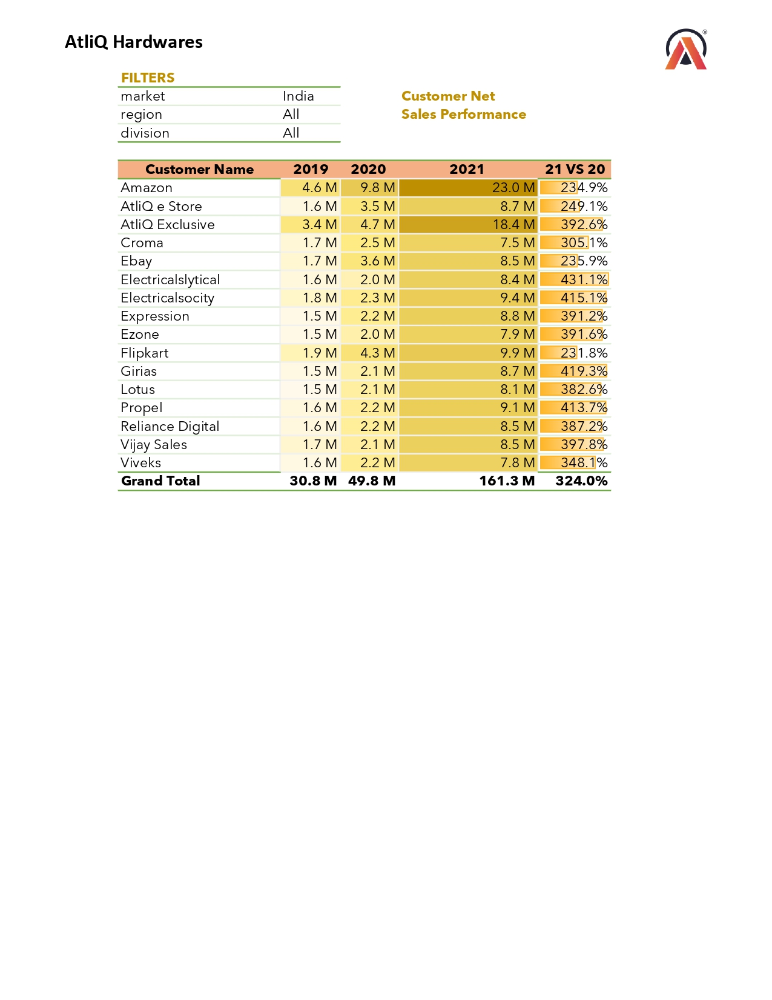
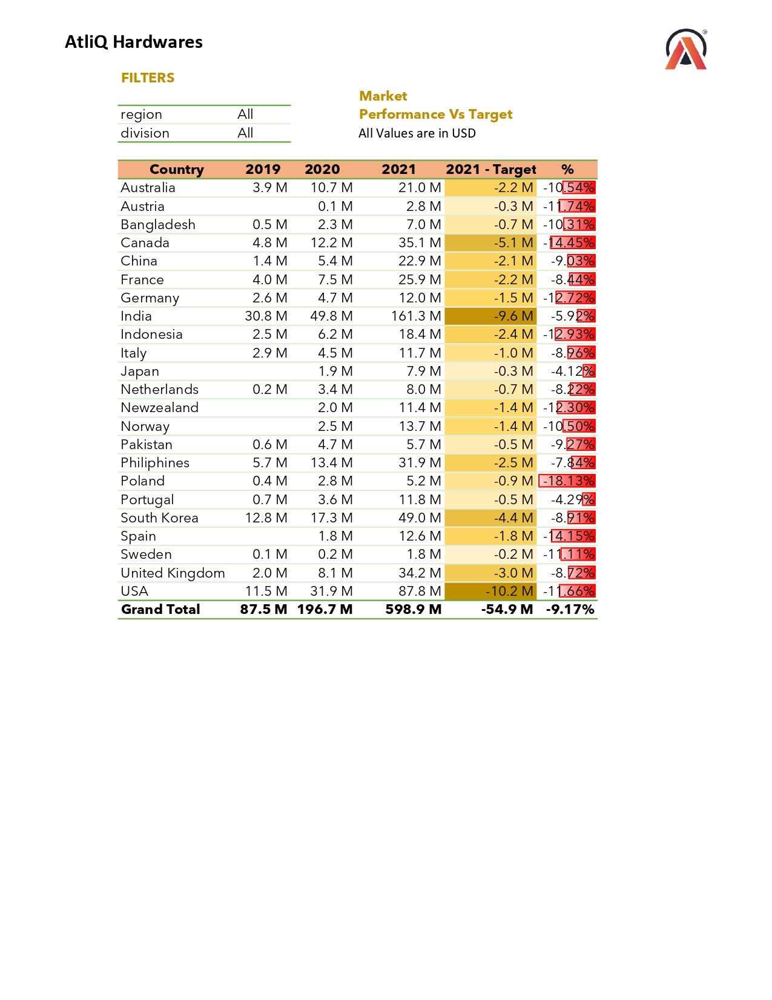
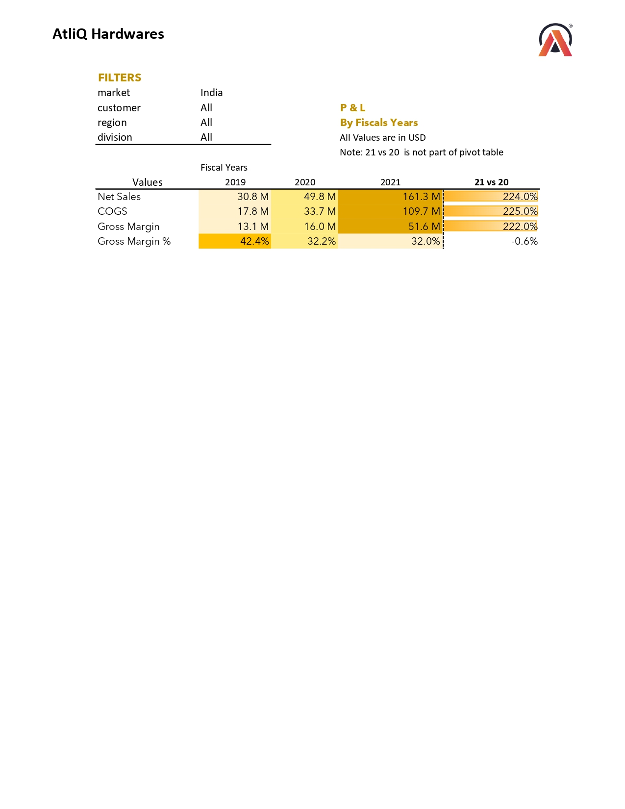
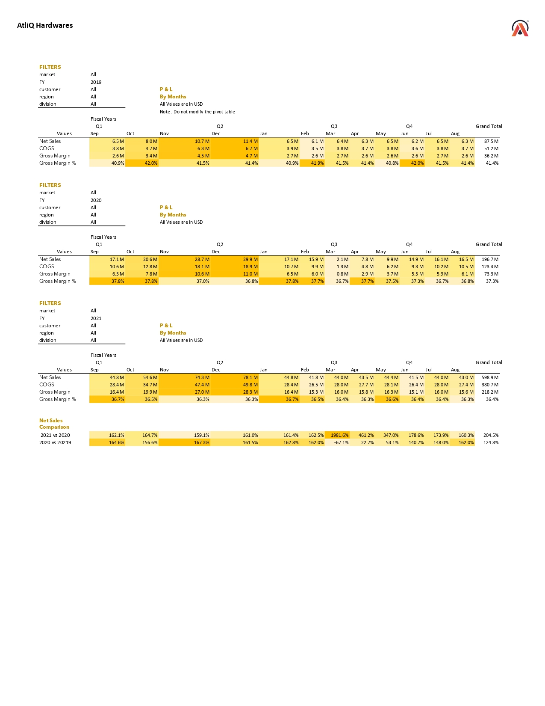
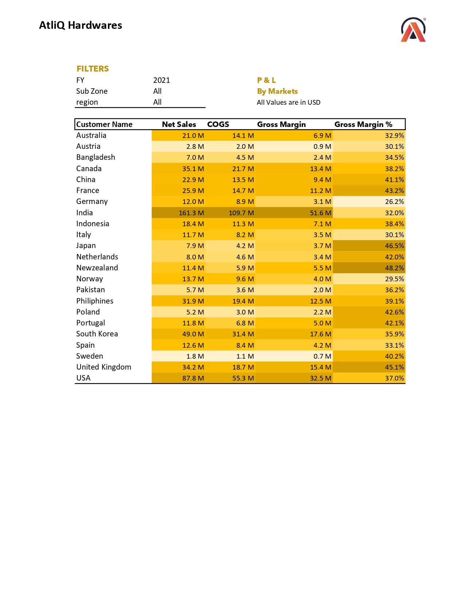

# 📊 Excel – Sales & Finance Analytics Project

A comprehensive Sales & Financial Analytics solution built using Excel, Power Query, Power Pivot, and DAX to generate actionable business insights and performance tracking dashboards.

---

## 🔹 Sales Report

### 🎯 Project Objectives
1. Developed a comprehensive [Customer Performance Report]

3. Perform an in-depth comparison between [Market Performance and Sales Targets]

---

### 📌 Purpose of Sales Analytics
Enable organizations to monitor, measure, and evaluate sales performance across customers and markets effectively.

### 📈 Importance of Sales Data Analysis
- Identify sales trends and performance patterns  
- Track and measure key performance indicators (KPIs)  
- Support data-driven decision-making  

### 🧩 Role of Sales Reports
- Optimize customer discount strategies  
- Support negotiation processes with clients  
- Identify high-potential markets for business expansion  

---

## 💰 Finance Report

### 🎯 Project Objectives
1. Generate Profit & Loss (P&L) reports by:
   - [Fiscal Year]

   - [Months]

1. Create Profit & Loss (P&L) reports by:
   - [Markets]

---

### 📌 Purpose of Financial Analytics
- Evaluate overall financial performance  
- Support strategic decision-making  
- Enhance communication with stakeholders  

### 📊 Importance of Financial Data Analysis
- Benchmark performance against prior periods and industry standards  
- Provide a strong foundation for budgeting and forecasting  

### 🧩 Role of Financial Reports
- Align financial planning with long-term strategic objectives  
- Strengthen stakeholder confidence in financial health  

---

## 🔍 Key Insights Derived

### 📌 Sales Insights
- Identified top-performing customers contributing the highest revenue share  
- Detected underperforming markets falling below targets  
- Revealed seasonal sales trends influencing monthly performance  
- Highlighted variance between actual sales and targets  
- Discovered opportunities to optimize discount strategies  

### 📌 Financial Insights
- Analyzed year-over-year revenue and profit growth  
- Identified cost structures impacting profitability  
- Determined high- and low-performing markets based on margins  
- Evaluated monthly profit fluctuations to improve forecasting  
- Established relationship between sales growth and operating profitability  

---

## 🚀 Business Impact
- Enabled data-driven decision-making through structured reporting  
- Improved visibility into customer and market performance  
- Reduced performance gaps through proactive target tracking  
- Strengthened financial planning with clear P&L insights  
- Supported leadership discussions with KPI-driven reporting  
- Enhanced reporting efficiency via structured data modeling  

---

## 🛠 Technical Skills Applied
- ETL (Extract, Transform, Load) methodology  
- Power Query (Data Transformation & Cleaning)  
- Dynamic Date Table creation  
- Fiscal Month & Quarter derivation  
- Power Pivot data modeling  
- DAX calculated columns and measures  
- Data relationship management  

---

## 🤝 Professional & Analytical Skills
- Sales & Finance reporting expertise  
- User-centric dashboard design  
- Report performance optimization  
- Structured and strategic project planning  

---

⭐ If you found this project insightful, feel free to explore the repository and connect with me.
